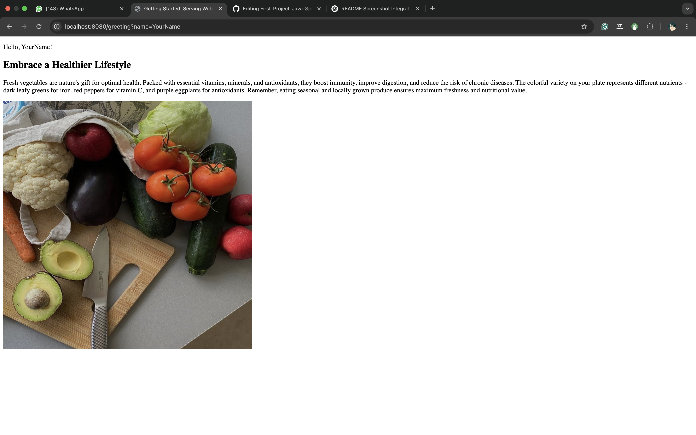

# Spring Boot Web App - Task 1

Simple Spring Boot application with:
- Text response at `/`
- Dynamic HTML page at `/greeting`
- Image display

## Quick Start
1. Run with: `mvn spring-boot:run`
2. Visit:
   - http://localhost:8080
   - http://localhost:8080/greeting?name=YourName

## Features
- `HelloController` handles requests
- Thymeleaf template for greeting page
- Shows vegetable image

- ## Screenshot of Result

  

## Tech
- Java 17
- Spring Boot 3
- Maven
